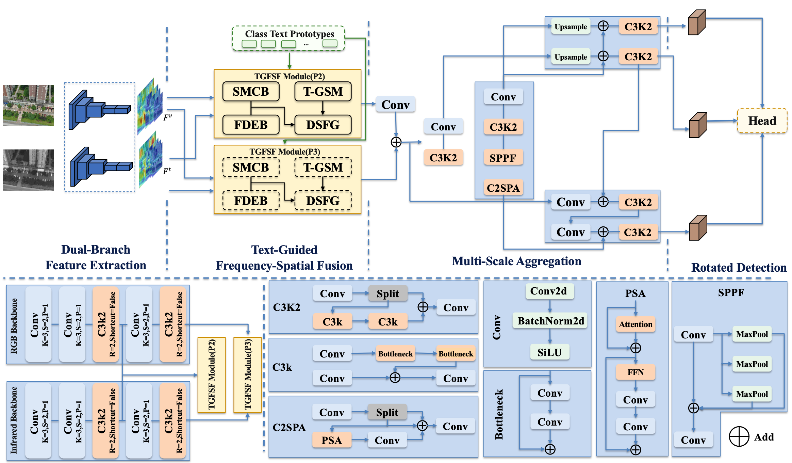

# TGFSFDet

This repository provides the project page for our paper:

**"Text-Guided Frequency-Spatial Fusion for Robust Oriented Object Detection in UAV RGB-Infrared Imagery"**

## Abstract

Unmanned aerial vehicle (UAV) object detection aims to 
accurately identify and localize objects of interest 
in complex scenarios. However, existing RGB-IR multimodal 
detection methods still suffer from insufficient exploitation
 of cross-modal information, missed detections of 
 weak-texture objects, and category confusion under 
 cluttered backgrounds. To address these issues, 
 this paper proposes a text-guided frequency-spatial 
 feature fusion method for RGB-IR object detection. 
 Specifically, a dual-stream backbone network with an 
 intermediate fusion framework is constructed to 
 facilitate the collaborative representation of 
 low-level detailed information and high-level 
 semantic information. A spatial-frequency collaborative 
 fusion module is then designed, in which the spatial and 
 frequency branches are dynamically weighted to enhance 
 cross-modal feature alignment and improve noise robustness 
 in complex backgrounds. Furthermore, a text-guided module 
 is introduced to inject category-level semantic priors 
 into the modulation process of fusion weights, thereby 
 improving the discriminative capability of object features 
 and the stability of detection. Extensive experiments 
 on the ATR-UMOD and DroneVehicle datasets demonstrate 
 that the proposed method achieves superior detection 
 performance compared with multiple state-of-the-art 
 methods, validating its effectiveness and generalization 
 capability.

## Framework

<p align="center">
  
</p>

**Figure 1.** Overall framework of the proposed method.

## Dataset

Due to license restrictions, we do not redistribute the original datasets.  
Please download the datasets from their official sources.

| Dataset | Description | Link |
|---|---|---|
| Dataset Name | Brief description | [Official Link]([your-link](https://github.com/VisDrone/DroneVehicle)) |

## Code

The source code and pretrained models are being organized and will be released after publication.

## Citation

```bibtex
@article{luo2026yourmethod,
  title={Your Paper Title},
  author={Luo, Zheng and others},
  journal={},
  year={2026}
}# TGFSFGet
